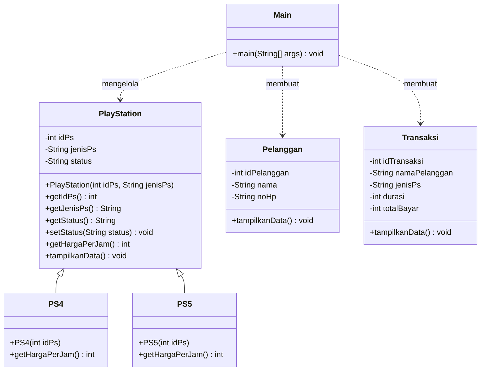

# Sistem Manajemen Rental PS

**Nama:** Zian Alrais
**NIM:** 2509116064

---

## Studi Kasus

Program ini adalah aplikasi berbasis konsol (Java) untuk mengelola usaha rental PlayStation. Pengguna dapat melihat daftar PlayStation beserta statusnya, melakukan booking berdasarkan durasi sewa, melihat riwayat transaksi, serta mengelola data PlayStation (tambah, ubah status, dan hapus). Harga sewa dihitung otomatis sesuai jenis PlayStation: PS4 Rp10.000 per jam dan PS5 Rp15.000 per jam.

Program terdiri dari enam kelas: `PlayStation` (superclass), `PS4` dan `PS5` (subclass), `Pelanggan`, `Transaksi`, dan `Main`.

---

## Diagram Kelas



**Hierarki class:** `PS4` dan `PS5` merupakan subclass dari `PlayStation`. Keduanya mewarisi atribut (`idPs`, `jenisPs`, `status`) dan method (`getIdPs()`, `getStatus()`, `setStatus()`, `tampilkanData()`) dari superclass, lalu menyesuaikan harga sewa masing-masing dengan meng-override `getHargaPerJam()`.

---

## Penerapan Inheritance

### 1. Superclass `PlayStation`

Berisi atribut dan method umum yang dimiliki semua jenis PlayStation.

```java
public class PlayStation {
    private int idPs;
    private String jenisPs;
    private String status;

    public PlayStation(int idPs, String jenisPs) {
        this.idPs = idPs;
        this.jenisPs = jenisPs;
        this.status = "Tersedia";
    }

    public int getHargaPerJam() {
        return 10000;
    }
    // ...
}
```

### 2. Subclass `PS4` dan `PS5`

Kata kunci `extends` menunjukkan pewarisan dari `PlayStation`. Constructor subclass memanggil `super(...)` untuk mengisi data superclass, sedangkan `@Override` dipakai untuk menentukan harga sesuai jenisnya.

```java
public class PS4 extends PlayStation {

    public PS4(int idPs) {
        super(idPs, "PS4");
    }

    @Override
    public int getHargaPerJam() {
        return 10000;
    }
}
```

```java
public class PS5 extends PlayStation {

    public PS5(int idPs) {
        super(idPs, "PS5");
    }

    @Override
    public int getHargaPerJam() {
        return 15000;
    }
}
```

### 3. Pemanfaatan pada `Main`

Objek `PS4` dan `PS5` disimpan dalam satu `ArrayList<PlayStation>`. Saat booking, method `getHargaPerJam()` dipanggil lewat variabel bertipe `PlayStation`, dan Java otomatis memakai harga milik subclass yang sesuai (polymorphism).

```java
static ArrayList<PlayStation> daftarPS = new ArrayList<>();

daftarPS.add(new PS4(1));
daftarPS.add(new PS4(2));
daftarPS.add(new PS5(3));

// Mengambil harga dari subclass PS4 atau PS5
int hargaPerJam = psDipilih.getHargaPerJam();
int totalBayar = durasi * hargaPerJam;
```

---

## Tangkapan Layar Program

### Menu Utama
[ss menu utama]

### Lihat PlayStation
[ss lihat playstation]

### Booking PS
[ss input booking 1]

[ss input booking 2]

### Booking Berhasil
[ss booking berhasil]

### Lihat Transaksi
[ss lihat transaksi]

### Kelola PlayStation
[ss menu kelola playstation]

#### Tambah PS
[ss input tambah ps]

#### Ubah Status PS
[ss input ubah status ps]

#### Hapus PS
[ss input hapus ps]

### Keluar Program
[ss keluar program]
